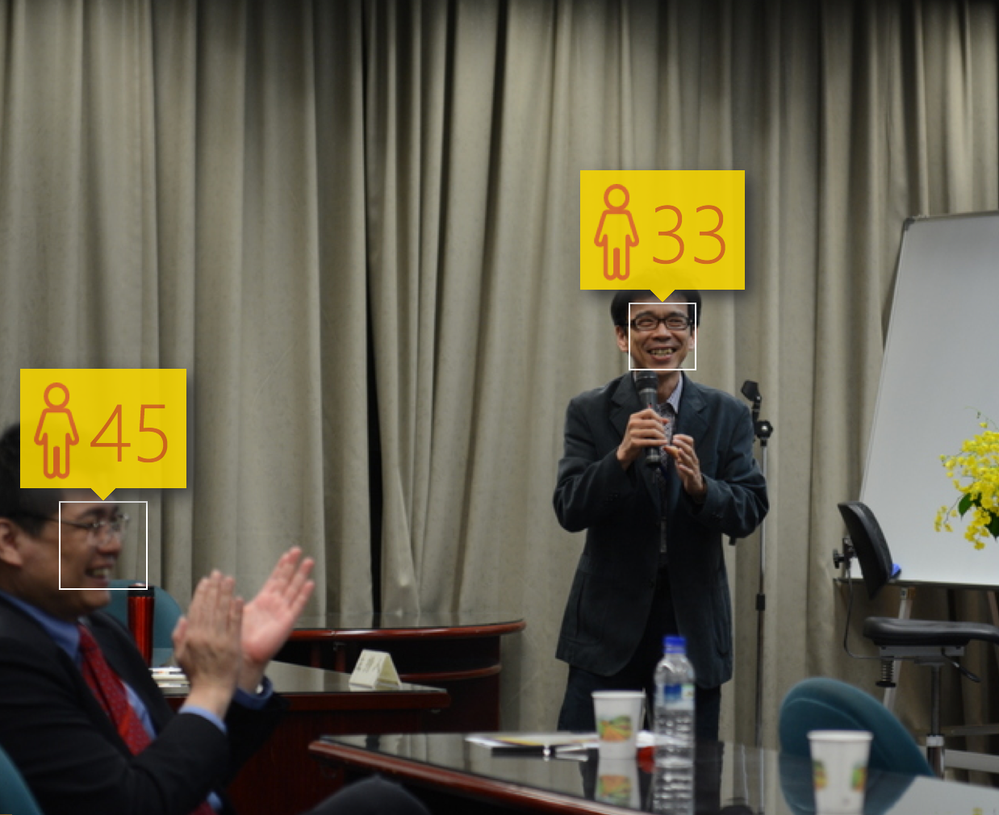
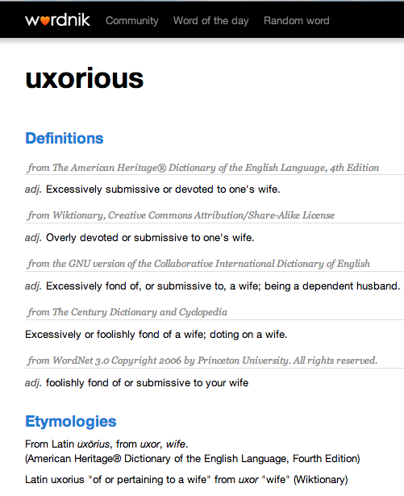
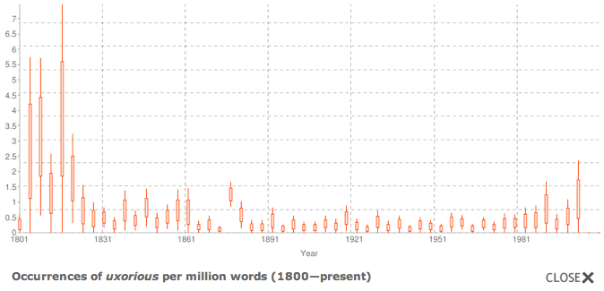
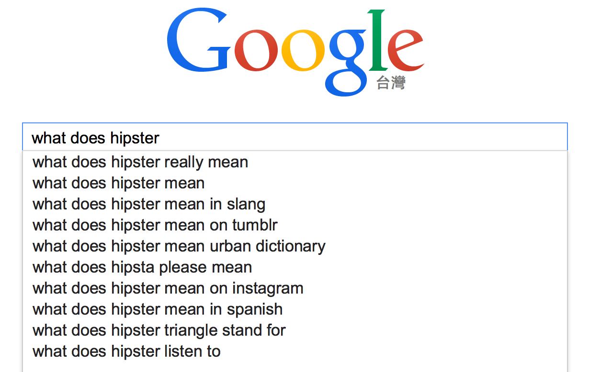
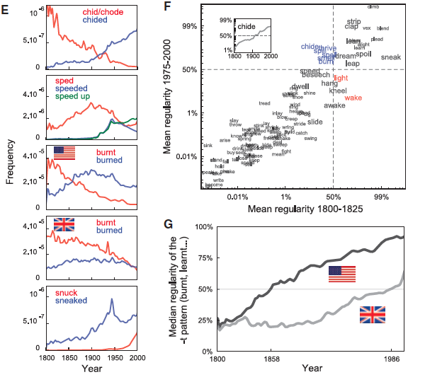
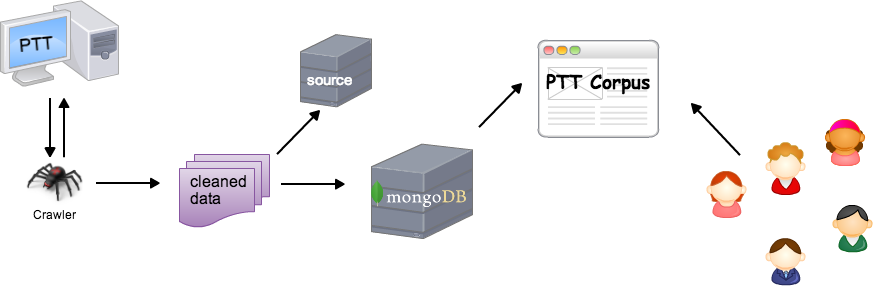

## Motivation: Age Guessing (X)

```{r, echo=FALSE, results='hide'}
library(knitcitations)
bib <- read.bibtex('/Users/shukai/LOPE_LexInfo/BIB/myRef.bib', .Encoding = "UTF-8", check =FALSE)
```



<!--
OPENING: 介紹自己，研究興趣 

I'm particularly interested in applications of natural language processing in lexicography for building better dictionaries and keeping dictionaries up to date.

附圖 two-column ：MS 的 age prediction (on me + 「謝舒凱」圖檔) 或黃居仁老師跟我的合照

-->

---
## Motivation: Lexical Age Guessing (X)


--- bg:#FFFAF0
## Outline
<!-- comment -->
1. Introduction
2. Previous works on Neologisms
3. Measuring Lexical Age
4. Conclusion


---
## Outline

1. __`Introduction`__
2. Previous works on Neologisms
3. Measuring Lexical Aging 
4. Conclusion


---
## Background  | Neologism brings challenges to Lexicography 

> Big data has Big impact on Lexicography?

<!-- > Next time you run a Google search, think about the fact that it's just one of 2 million that Google will receive in that minute. In the same amount of time, Facebook users post 684,478 pieces of content. Crazier still, online shoppers spend an average of 272,070 every minute. That's over 391 million every day — quite the chunk of change.-->

- Influx of neologisms: a new word is created every 98 minutes (Global Language Monitor). An estimated 800 to 1,000 neologisms are added to English language dictionaries each year (in the 20th century alone, more than 90,000 words have been added). (http://www.languagemonitor.com/no-of-words/) 

<!-- Editors of the third edition of the OED, to be completed by 2037, estimate that the rate of inclusion of new words into the OED are about 4,000 per year.
-->

- The majority of new words in fact fail to become established in language. (Algeo,1993)

- Without the lack of adequate empirical tools, even the *word-watching website* can only observe from the sidelines.

--- &twocol
## Background  
### Neologism brings challenges to Lexicography 

> (Algeo,1993) points out that even those words that do make it into dictionaries often fall out of usage. 58% of the new words collected in the *Britannica Book of the Year* between 1944 and 1976 were not rewarded with a dictionary entry (quoted from `r citep(bib[['cook2010exploiting']])`)  


*** =left


*** =right



---
## No more **uxorious**? who said that?!




--- &twocol
## An Embarrasing Lexicographical Example

*** =left 

> All dictionaries will turn out to be diachronic/historical/etymological ones? (if no one retired)


*** =right


#### An example of MOE Chinese Dictionary (教育部國語辭典為例) APP: full of 'desuetude' 
#### 11 new words out of 3 paragraphs randomly picked.


---
## Since when has Google become a Dictionary

> Millennial. hipster. yuppie. muppie. Henry, and now, yuccie.




---
## Neologism brings challenges to Linguistics 
### Lexicalization and Language Change

- Language in use is a dynamically developing system adapting to its ever-changing social environment.
- Language change: phenomenon or epiphenomenon (of a static capacity, Lehmann 1993:320)?
- Lexicalization: the process by which new items that are considered 'lexical' come into being (Brinton and Traugot, 2005)
  - __adoption into the lexicon__
  - __falling outside the productive rules of grammar__


---
## The Emergent Lexicon 

- Lexicon is understood as *a finite list of forms and the possibilities for combining them*

- Functionalistic take on the (Mental) Lexicon (,if any):
    - 'our understanding of both language structure and use is enhanced by the recognition that memory for language is highly affected by language use' (Bybee,1998).
    - The memory representation of language consists of units that can constitute utterances or intonation units, i.e., not just words, but also phrases and constructions. 

- It is the __formulation__ that annoies linguists.


---

## The Emergent Lexicon 

$$
\mathbf{Change}_{a,b} = \mathbf{A} \succ \mathbf{B}
$$

$$
\mathbf{Change}_{a,b} = \mathbf{A} \succ 
 \begin{Bmatrix}
  A \\
  B 
 \end{Bmatrix}
 \succ \mathbf{(B)}
$$

`Most attention were paid to the questions "What is in the arrow?" and "How does change come about?"`

--- 

## The Emergent Collective Lexicon:

Lexicographically, we can define

- **diffusion** denotes the 'dynamic spread of novel formations across the language and its speakers'; while **conventionalization** refers to the 'dynamic socio-pragmatic process by means of which a linguistic innovation becomes established in the language and the speech community' (Kerremans, 2015).

<!-- the former facilitate subsequent retrieval from memory; the latter implies the establishment in the mental lexicon -->
<!-- Lexicalization (and grammaticalization) 談的是如何進場 -->

<!-- 網路時代的海量數據引出了語言單位的**生命力**指標量度需求（能活多久或為何退場--> 

- we need a reference measure of lexical age ("vitality" or "durability") for words to help justify their inclusion/exclusion in dictionaries. BUT note!! [pressing `p`]

*** =pnotes
<q>Old words never die, they just fade away</q>

In some cases words might be *dead* to all purposes, but could revived by the media periodically for the purpose of *irony* or *parody*.


---
## Questions to be answered 
  
**Big Three** (Brinton and Traugott, 2005)

1. The constraint problem: what is the set of possible changes and linguistic conditions for change?
2. The transition problem: what are the interesting stages that define the path by which A gives rise to B?
3. The actuation problem: how does change start, when and where does it start ('actuation') and how does it spread through the system ('actualization')?

  
**Missing**
  
<a class="btn btn-large btn-danger" rel="popover" data-content="How does words survive? what is the life cycle? When to be recorded in Dictionary?" data-original-title="4th Question" id='example'>The survival problem</a>


<!--
---
## Our Question | What's the Successful Story of, the Words?

- (not) the morphological rules of coining new words, or the revival of old usage (..)
- how they sustained and expanded their meanings and functions (evolve into polysemy)
-->


---
## Outline

1. Introduction
2. __`Previous works on Neologisms`__
3. Measuring Lexical Aging as an Example
4. Conclusion


---
## Previous Approaches

- Linguistic
- Psycholinguistic
- Applied lexicological
- Computational linguistic


--- bg:#F0FFF0
## Linguistic approach | Neologism and Lexicalization

- Lexicalization is viewed as the way to enrich the lexicon. Lipka (1990) "..the phenomenon that a complex lexeme once coined tends to become a single lexical unit, a simple lexeme."
- Neologisms (new entries in the inventory) can be seen as the results of the *conception of lexicalization*.
- The production of neologisms encompasses a wide variety of linguistic processes, both sybchronic and diachronic.
- Mechanisms involved: *create, modify, combine,* or *separate* existing units, and thus lexicalization would seem to include opposing directions of change leading to greater or lesser **dependency** and greater or lesser **compositionality**.


--- bg:#F0FFF0
  
## Linguistic approach | Neologism Classification
  
(`Renouf's classification` 2013) 

  * __lexical neology__ (i.e., newly-coined lexical items) e.g, [Arab Spring](http://www.google.com/trends/explore#q=Arab%20spring&cmpt=q);
  
```
Note: various morphological mechnisms for lexical neology `r citep(bib[['cook2010exploiting']])`: 
'lexical blends'  (e.g., 'webisode' is a blend of web and episode), 
'text messaging forms'  (e.g., 'any1' for anyone).
```
  
  * __semantic neology__ (i.e., new sense of word) e.g, 'troll' (an individual who posts inflammatory, rude, and obnoxious comments to an online community); 'sick' (mean ‘excellent’, an amelioration)
  * __grammatical neology__ (i.e., neologisms that change grammatical class).  [friend](http://www.wordnik.com/words/friend)


*lexical neology* and *semantic neology* can be identified in a text corpus at surface level by automatic means (by comparing existing lexicon and discovering the change in collocational environments), while *grammatical neology* can be identified at a post-processing stage of semantic neology.


--- &radio

## Examples of Popular Culture Neologisms

[Staycation] 屬於那一類新詞? morphological strategy?

1. _lexical neology_
2. semantic neology
3. grammatical neology


*** .hint
Lexical Blends

*** .explanation
> A vacation at home or in the immediate local area.


---
## Psycholinguistic | Neologism and Lexical Memory

> How do neologisms leave the memory trace in our mental lexicon? (frequencies of exposure, types of neologisms, ...)


- `r citep(bib[['de2007regular']])` For the neologisms, a stepwise mixed-effect regression analysis resulted in a model with significant main effects of Length, and Number of Synsets. As for the existing words, ratings increased with increasing Length ($\hat{\beta}$ = 0.238, t(877) = 2.805, p = .0051) and decreased for increasing Numbers of Synsets ($\hat{\beta}$ = −0.560, t(877) = −3.359, p = .0008). 新詞 詞長度越長，越熟悉。 synset 數量越多（越多義）越不熟悉。
 
> 不過我們關心的是 collective mental lexicon (constrained by real world / socail communication)


---
## Leixogrpahy in Practice
> How do you decide whether a new word should be included in an Oxford dictionary?

- paradox: in order to find usages of a previously undocumented word suspected of being new, one would have to wait until it was encountered during reading (Barnhart, 1985).

- corpus-based/aided method changed lexicographer's works. `r citep(bib[['atkins2008oxford']])`

<!--The Collins COBUILD English Language Dictionary broke new ground in lexicography by being the first dictionary to be based entirely on corpus evidence (Sinclair, 1987).
-->


---
## Lexicogrpahy in Practice

`r citep(bib[['metcalf2004predicting']])` : FUDGE factors for determining whether a word will remain in usage


$$latex
\Sigma (\mathcal{F}_{0-2}, \mathcal{U}_{0-2}, \mathcal{D}_{0-2}, \mathcal{G}_{0-2}, \mathcal{E}_{0-2})
$$

- F: Frequency
- U: Unobtrusiveness
- D: Diversity of users and situations
- G: Generations of other forms and meanings
- E: Endurance of the concept to which the word refers.


---
## Leixogrpahy in Practice

`r citep(bib[['barnhart2007calculus']])`: 

$$latex
\mathcal{V} * \mathcal{F} * \mathcal{R} * \mathcal{G} * \mathcal{T}
$$

- V: the number of forms of *w*
- F: the frequency of *w*
- R: the number of sources in which *w* occurs
- G: the number of genres in which *w* occurs
- T: the time span over which *w* has been observed.


---
## Corpus-based Applied Lexicology 

- **Frequency effect** takes the lead and entrenchment drives the effect?
- Quantitative formulation (..) delineate proposed life stages and "predict whether a word may be survived after being coined".

---
## Corpus-based Applied Lexicology | Stages

<!-- newly-coined words vs established words found in a dictionary-->

- `r citep(bib[['kerremans2014web']])`  : four stages of conventionalization.

- Life cycle of a word: *birth, settling down, obsolescence, death, and re-birth* (Renouf 2013)


---
## Corpus-based Applied Lexicology 

- Word frequency variations take place both due to external and internal factors. 
  - Product-words (P-words) : driven exogenously by events that are external to the group
  - Slang-words (S-words): more endogenously influenced by the social values and language patterns of the communication group.


- indexicality: being used by different individuals
- topicality: being used in different topics.


---
## Quantitative Lexicology 


- Quantitative studies have brought to significant progress in the understanding of word's *life-stage statistics* (originated, evolved, die out) and *language evolution*.
- Different statistical model of word usage frequency dynamics have been proposed.
  - e.g., `r citep(bib[['altmann2013identifying']])` reveals strong relation between changes in word *dissemination* and changes in *frequency*; `r citep(bib[['petersen2012statistical']])` ... 
  


> since neologisms are expected to be rather infrequent due to the recency of their coinage, methods for lexical acquisition that rely solely on statistical distributional information are not well-suited for learning syntactic or semantic properties of neologisms, particularly those which have very low frequency. `r citep(bib[['cook2010exploiting']])`


--- {class: class, tpl: tabs}

## Computational Approach | Novel word sense detection

<!-- 
http://cs.unb.ca/~ccook1/elex2013.pdf
-->


*** {class: active, id: language resources}

You need **corpus and lexicon** are the prerequisite for an empirical surveys. A *reference* corpus will make the identification task simpler: An *unseen* word is matched against the corpus so that it is pinpointed at its first occurrence, and deemed to be a candidate for neologism. (cf. *hapax legomena*)

*** {id: algorithms}


Use **collocational information** to (semi-) automatically determine the candidate's usage and definition.


---
## Outline

1. Introduction
2. Previous works on Neologism
3. __`Our Approach`__
4. Conclusion


---
## Our Concern

- Do we have the chance to develop a stabalization measure of neologisms that indicate whether they are likely to remain in usage, (and therefore should be included in a dictionary). 

- What's the role of linguistic knowledge in this exploratory process


---
## Our Approach | Going deep with big data

- Tsunami of linguistic data; influx of neologisms

<!-- However, because of a lack of precise knowledge of the value embedded within this huge crush of data, many businesses have been stuck in the “data for data’s sake” trap .... Deep data? another industry buzzword?--> 

- Deep data trumps Big data : "Deep Data framework– an approach based on the premise that a small number of information-rich data streams, leveraged properly, can yield more value than masses of captured data"

- Machine learning on big corpus data | Human exploiting the deep linguistic knowledge based on even small number of usages.
<!-- write a googlebook ngram shiny for demo -->


---
##  Language Resources used 

- Google Book ngram corpus (training data to gain insight)
- UDN (The United Daily News): provides newswires over several years in Taiwan.
- Word list from MOE (1997) 
- PTT corpus : neologism sensor?
- DeepLex


---
## Google Book Ngram Corpus (GBNC): Overview

- Google Book project of digitized texts containing about 6% (over 8 million books) of all books ever printed. 
- N-gram corpus extracted from the project include distributions of n-grams in books written over the past 200 years.

<!-- 可考慮 googlebook ngramr -->


---
## [Culturomics](http://www.culturomics.org/), Lexicography, and Big Data


> Analysis of this corpus enables us to investigate cultural trends quantitatively. We survey the vast terrain of 'culturomics,' focusing on linguistic and cultural phenomena that were reflected in the English language between 1800 and 2000. We show how this approach can provide insights about fields as diverse as **lexicography**, the **evolution of grammar**, collective memory, the adoption of technology, the pursuit of fame, censorship, and historical epidemiology.(*Science, 331(6014): 176–82*, 2011).


--- &twocol

## Google Books for Culturomics

*** =left 
#### The evolution of grammar

- Competition between regular and irregular verbs: It took 200 years for the fastest-moving verb ("chide") to go from 10% to 90%.


*** =right


<!--
<iframe src='assets/img/gngram.png' width=800px height=250px>
</iframe> 
-->

---
## World Knowledge, Language, and Big Data

- Google's Provides Free Access (via BigQuery) to GDELT project
- Danger of de-contextualization though.


---
## Our Linguistic Toolbox | DeepLex 

> * It takes the functional position (usage-based view) in determining units and patterns (in Chinese), as well as the ontological grounding on the relation between linguistic objects and situations (bits of reality). (Langacker 1987, 1988, 1999; Croft 2002; Tomasello 2003; Bybee 2006, 2010)

> * Lexical data at different levels are modularized (only for practical reasons), such as syntax-semantics module, emotion module, discourse and pragmatic module, diachronic module, etc. Researchers from different fields can initiate a new cooperation based upon. 

---
    
## The Deep LEXICON Project: Variables

| **Module.Variable**        | **Description**                       |
|---------------------|---------------------------------------|
| `concept.sense`     | word sense number from [Chinese Wordnet, CWN](http://lope.linguistics.ntu.edu.tw/cwn2/), please [help](http://lope.linguistics.ntu.edu.tw/cwikin/)       |
| `concept.gloss`     | sense definitions from CWN    |
| `concept.relations` | lexical semantic relations      |
| `emotion.polarity`  | polarity of descriptive emotional words|
| `emotion.location`  | location collocates of emotion  |
| `emotion.cause`     | cause collocates               |
| `emotion.result`    | resulting event collocates        |
| `emotion.time`      | time collocates        |
| `frequency.asbc`    | frequency of Sinica Corpus|
| `frequency.plurk`   | frequency of Plurk Corpus       |
| `frequency.childes` | frequency of CHILDES Corpus  |
| `frequency.ptt`     | frequency of PTT                    |

**AND MANY OTHERS!** modules in progress: 情緒 發展歷程 語義 使用頻率 年紀 關係 性別 教學難易 部首概念 意類 知識本體 社會心理人格 . . . . . . . . . . . . . .  

<!--
- phonological module
- morpho-syntactic module
- semantic-pragmatic module
- sociolinguistic module
- affective module
- ontology module
-->


---
## Time-series: a pilot study for short-term frequency

`r citep(bib[['liu2013observing']])`

- PTT-based (2015-2012, 八卦版+就可版+笨版), preproceesed.
- PTT Corpus (`http://lopen.linguistics.ntu.edu.tw/PTT`)




---
## Time series predictive model

<iframe src='assets/img/timeseries.png' width=200px height=90px>
</iframe> 


---
## Results and Discussion

- These large, short-term fluctuations add an important new dimension to the study of the long-term dynamics of language, as any novel expression must survive in the short term to survive in the long term. (Altmann, 2011). But short-term frequency data do not reveal the difference between diffusion and stablization.


---
## Results and Discussion

How many years to be observed ?

- (Chang 2008; Wang 2010) proposed to use normalized frequency within a year or so to judge whether a once diffused new word is conventionalized is using or is failed to be captured. (Xu,1999) proposed that 10 years should be the criteria.

- Since the Surface Frequency measure is 'zero' for all neologisms, hard to be a good indicator for stablization index.

- 也容易受特定事件影響。Some words may sporadically come into fashion in certain external events.
e.g., 挺 may come and go follow the start and end of election. 花博。本研究把與特定事件 bind 在一起的叫做 fashion word, 不處理。


---
## DeepLEX is in

<!--詞彙不像人，可以離群索居，成就自己的意義。詞彙的意義是透過系統間的關係相對定義出來的。
因此我們認為應該關注詞彙的社會行為。-->

BTU Question: 那些變項|組合最大地決定了`詞彙年齡` (存活能力) ? 
  

---
## Modeling Lexical Aging: Our Second Comings 

不是二元的分類問題，應有新的訓練與評測方法

1. Use `google book ngram` as training data (to infer the laws), and `ptt` as test data.

2. In addition to previous efforts that exploit the syntagmatic patterns of a candidate neologism (e.g., via `collocate profile`), we also propose to incorporate paradigmatic patterns (via creating `social network` of the candidate).

4. Power the predition model with weights from human jugements (via questionnaire web application or APP games)


---
## Our Approach | Targets and Hypothesis

<!-- BORN :The time span over which a word has been used —the date between the first citation-->

* Focus only on: 
  * words that are `newly diffused` (for about 1 years).
  * words that were considered `new words` (50 years ago).
  * words that are assumed to be `conventionalized` (existed over around 50 years).
  
  ```
  Proper nouns are ruled out, for they are mostly propelled into the media glare due to 
  a real-world event ot popular preoccupation.
  ```

<!-- words that are `inactivated`.-->

* Hypothesis
  - 跟競爭/適者生存有關係 e.g. ic vs ical
  - Linguistic knowledge can be exploited to infer the survival chance.


---
## Goal 
### Discovering Influential Factors 

What are the driven (linguistic) factors for a lexical item to enter the *collective mental lexicon*?

* (Short-term) usage frequency pattern
* Lexical social network


---
## Regression Modeling of the Life Stage of Diffusion and Stabilization

- ex


---
## Finding the Linguistic Niche 
### Lexical Social Network

- (Altmann et al., 2011) proposed the concept of *niche*, defined as the relationship between the word and the characteristic features of the environments in which it is used.
    - Two important aspects of the size of the word niche to be quantified: **the range of individuals using the word** and **the range of topics it is used to discuss**.
    - Controlling for word frequency, they show that these aspects of the word niche are strong determinants of changes in word frequency.
    
<!-- Using Internet discussion communities as model systems, -->

- (Baayen,2008) developed measure of `the age of a verb` on the basis of an etymological disctionary, and found that **neighborhood density if the stem** is a predictor for the age of a verb.

- "New words which are in competition with an already established word (i.e., the new word and established word are roughly synonymous) are more likely to succeed than new words which are not in competition with an established form". `r citep(bib[['boulanger2002makes']])`, quoted from `r citet(bib[['cook2010exploiting']])`).

<!-- You can imagine that In the no-competition case, both the new word and new referent must be accepted.-->


---
## Finding the Linguistic Niche
### Lexical Social Network


<!--
```{r, fig.width=8, fig.height=5, echo=FALSE}
library(languageR)
colnames(etymology)
```
-->


---
## Distributed Social Network of Neologisms
### SNA's parlance 

- 交各式各樣的朋友 (Make friends, as many/varies as you can)
- 在競爭環境下找自己的利基點 (Compete with established ones if you can) 

1. Frequency Diversity (e.g., the dissemination of words across individuals/generations/topics/boards/...)
2. Strength of Ties
3. Niche (when different forms compete to express the same meaning)

```
Distributional (Semantic) Model based on the Deep LEXICON
```


---
## Magic Formular identified 

Measure of Inclusion: (Hseih et al. forthcoming)
$$latex
\mathcal{I} = \ln( \alpha \mathcal{F} + \beta \frac{S}{P}) 
$$

- F: frequency diversity within short-term time span (revised constant U)
  - number of sources (ptt and newspapers)
  - number of genres (different boards)
- S: syntagtic lexical network via *collocation variations* (type/token)
- P: paradigmatic lexical network via *distributional proximity*

<!--
1. some of these properties may play a larger role in determining a word’s importance for inclusion in a dictionary than others. A supervised machine learning algorithm could be used to learn an optimal weighting for the various properties. 
2. it may also be the case that applying a non-linear transformation to the values for the properties—such as the natural logarithm—could make the values more informative; taking the natural logarithm has the effect of emphasizing the differences between smaller values, which may be particularly important in the case of frequency, since neologisms are expected to have relatively low frequency.

syntagmatic: can be viewed as a words that occur consecutively in text;
-->

<!--
```{r block2, fig.width=8, fig.height=5, echo=FALSE}
library(glmnet)
load("QSExample.RData")
fit = glmnet(x, y)
plot(fit)
```
-->


---
# Dictionary as A Mashup (from a non-lexicographer's need)

- Design instead of Compile: linguistic annotation craft
- Mobile, customized, ... can't resist 

```
user experience, etymology, establishment estimate, 
```

---
## Dynamaic Neocrawler, Sketch and Estimation


- Crawl the posts/articles from PTT/newspapers on a daily base.
- Compare with entries in Deeplex, filter out (through rules and manual check) the candidate neologisms.
- Sketch the profile, calculate the I score.
- Crowd weighting.


--- 
## Prototypical System 

NeoCilin: <http://lopen.linguistics.ntu.edu.tw:12345/>
<!-- A case study of using DeepLex to leverage the Big data. We pick up every new lexical data stream if it ... -->
<!--Instead of going down the big data path, where there's a lot of data you could potentially analyze, but for relatively little incremental gain, we instead [focus on] the bare minimum that tells us the most about a building
-->


---
## 問題：

- variant forms and spellings: (text normalization: to convert all instances of a word in its various forms to a single canonical form? (e.g., google-googled;) 頗喝


---
## Conclusion

* **New paradigm of Doing Lexicography with B & D:**
  - Big linguistic data can help machine training of the understanding/inference of the global lexical behaviour (e.g., semantic changes).
  - Deep linguistic knowledge can help identify the stabalization process of neologisms, and we have proposed a reproducible, dynamically updated measure for lexical stablization.

<!-- New words are expected to be low frequency due to the recency of their coinage, and therefore purely distributional information is not reliable in this case.  
-->

  

* **Limits and Future works include:**

  - Evaluate the results 
      - against lexicographers/crowds.
      - by calculating the *I* score of all the entries in the dictionary. 
  - Work on semantic neology (漂亮 vs 正) and automatic re-ordering of senses (in Wordnet)

<!-- neologism as forms which have been recently added to the language vs 'established forms in a dictionary' is an questionable contrast--> 

<!-- This thesis sets the stage for further research into automatic detection of lexical age ... which have not been extensively considered in lexicography. -->

---
## Acknowledgement

> 王伯雅 (Amber Wang) 劉純睿 (Owen Liu)


---
## Reference

```{r results = "asis", echo = FALSE}
bibliography()
```


